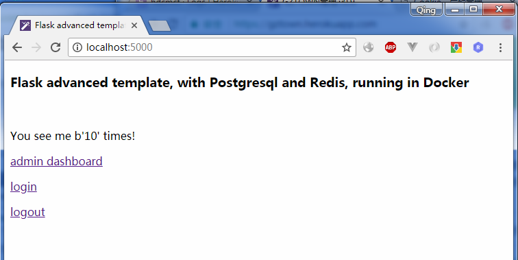

# Flask advanced template in Docker

> Running advanced Flask app template in Docker, with services of Postgresql and Redis

> Based on https://github.com/kevinqqnj/flask-template-advanced



## Features:
- One Docker, to develop anywhere with all same env.
- Ready for use of services: Postgresql and Redis

## Pre-requirements
- Docker installed (that's all!)

## Start up
- git clone this repo.
- cd to dir
- docker-compose up --build
- open http://localhost:5000, now flask and Redis should work!

Configure Postgresql:
- Open another terminal
- use psql tool to create new database in postgres, e.g.: myapp_db
- cd to dir
- docker-compose run web bash
- python manage.py deploy
- python manage.py initrole

Now open http://localhost:5000/admin, now flask and Postgresql should work!

## deploy to Heroku Server
ready for deploy to [Heroku](https://www.heroku.com), `Procfile` and `runtime.txt` are included.
```
# create app in heroku
# git push to heroku
# configure env. variables
# init database by using manage.py
```
for details, refer to: https://devcenter.heroku.com/articles/getting-started-with-python

